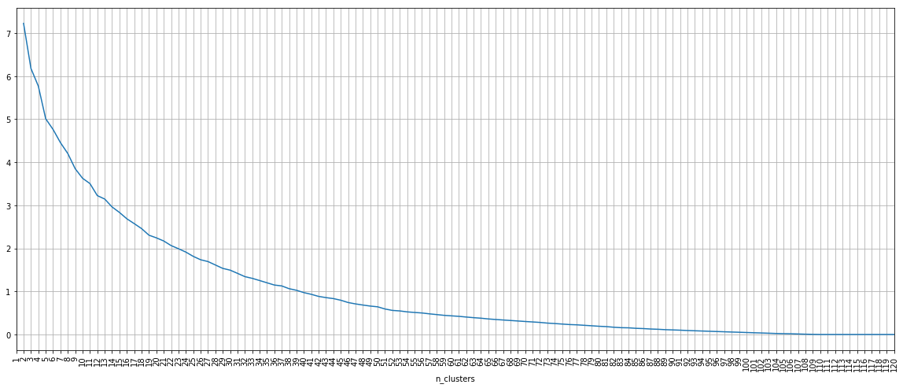
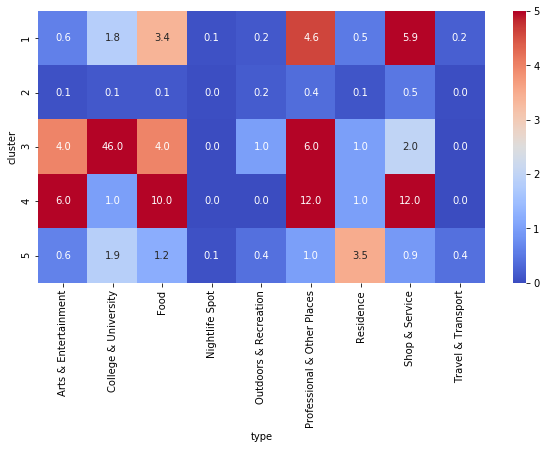

# Getting to know Rexburg
**Where to live, where to eat, what to do**

_[IBM Data Science Professional Certificate](https://www.coursera.org/professional-certificates/ibm-data-science) Capstone Project, January 2020_

## Introduction & Data Science Problem
Rexburg, Idaho, USA is a small college town in the state of Idaho in the United States' northern intermountain west.

A close family member of mine is moving to Rexburg in a couple of months to attend college. He's never been to Rexburg before. I'll help him get to know the town and think about where to look for apartments by building and analyzing an unsupervised machine learning model to cluster areas of the town.

## Data
I'll be using the [Foursquare API](https://developer.foursquare.com/places) to retrieve information about places in Rexburg. The `explore` endpoint will return venues in all categories centered on a set of coordinates within a radius.

I'll also pull information from the `categories` endpoint to recreate Foursquare's category hierarchy for my analysis. The rationale for this will become clear in the _Methodology_ section.

## Methodology
### Define the geographic area of interest

Since my objective is to help a prospective college student who'll be moving to Rexburg get familiar with the town's resdiential, food, and recreation options, we'll arbitrarily choose a 4km by 4km square centered around the college campus.

The coordinates of the four corners of this square are:

| Lat/Long | West                     | East                     |
|-------|--------------------------|--------------------------|
| <b>North | 43.840199 -111.807453 | 43.840199 -111.757579 |
| <b>South | 43.804226 -111.807453 | 43.804226 -111.757579 |

### Retrieve Foursquare venues
I used the [Foursquare API](https://developer.foursquare.com/places) to retrieve information about places in Rexburg. The `explore` endpoint will return venues in all categories centered on a set of coordinates within a radius passed to the API.

Since each call is is limited to 100 results, I want to search an area small enough to capture as many venues as possible. The "sandbox" version of the API is limited 950 "regular" API calls (of which `explore` is one) per day.

To balance the need for granularity with the number of daily API calls I can make, I split the area of interest into a 20 by 20 (200m by 200m) grid, and call the API from the center of each grid section. That should be a small enough grid section size to ensure I don't hit the limit of 100 venues, and it uses less than half of my daily API quota.

### Data cleaning
The data required cleaning in three main areas.

#### Duplicate and out-of-area venues

The radius I passed to the API needed to be large enough to inscribe each grid section in a circle. The searches will overlap, as shown below, so the initial dataset included a substantial number of duplicates, as well as venues outside the border, which needed to be eliminated.

#### Blank categories
Thirty venue records came back with a blank cateogry. I individually recategorized or deleted these based on whether the venues seemed relevant to our task and on what I could find out about the venue through internet searches.

#### Highly fragmented categories
A look at the distribution of categories in the Rexburg venues data revealed a very long tail: of the 213 unique categories, over 170 appeared in fewer than 5 venue records. This long tail would make it more difficult for the model to cluster venues in these low-frequency categories. Also, venue-level categories proved too granular for some of my analysis. For example, I wanted to see all places relating to food, but "grocery stores" and "Mexican Restaurants" were in separate categories, and even at different hierarchy levels.

To address this issue, I retrieved the category hierarchy from the Foursquare API and added category groups (hierarchy level 1) and venue types (hierarchy level 0) to the dataset, enabling me to roll up the data. This allows visualizations like the one nearby, which shows
- residential venues in blue,
- food venues in red, and
- recreational venues in green.

### Modeling
We'll employ the _k_-means algorithm to cluster areas of town into groups with similar venues. Since we don't have neighborhoods, and since most towns in the intermountain west are laid out as a grid, we'll divide Rexburg up into a grid and use the grid sections to represent "neighborhoods".

After testing several grid sizes, I selected a 15 by 15 grid for modeling. I looked at inertia and silhouette score across many values of _k_.

Silhouette score dipped at 2 clusters, which felt like too few, and then again at 8 clusters. 

The inertia plot was fairly smooth, with no obvious elbow, although if I squinted a bit, I saw one at _k_=5.

Since both metrics accommodated five clusters, I used that hyperparameter in the production model.

## Results
Our production model produces the following clusters of grid sections, with a silhouette score of 0.587.

  
To suss out the distinguishing features of each cluster, I mapped average venue count per grid section against cluster and venue category types to produce a heatmap.

## Discussion
Combining the heatmap with a listing of the top 15 venue category groups per cluster, I was able to give the five clusters snappy names and descriptions:

- **_Cluster 1: Business District_**
    - With offices, medical buildings, shopping, and banks, this is where you go to get stuff done.

- **_Cluster 2: The Burbs_**
    - Sparsely dotted with churches, schools, and parks, this is where people who don't care to be walking distance to campus live and play.

- **_Cluster 3: The University_**
    - All college, all the time.

- **_Cluster 4: Downtown_**
    - Arts, entertainment, food, and offices: it's the center of the bustling metropolis of Rexburg.

- **_Cluster 5: Residential Zones_**
    - With 4.5 residential buildings every 15 or so acres or so, churches, and college buildings, this is where the college kids live to keep their walk to campus short.

It's also worth noting that there is absolutely no night life in Rexburg, so you'd better have Netflix or really like homework.

## Conclusion
Although we might have been able to get similar information from some Google maps searches, this model allows my family member to quickly see what's going on in Rexburg and get a sense of where to live, where to eat, and what to do when he gets to college.
